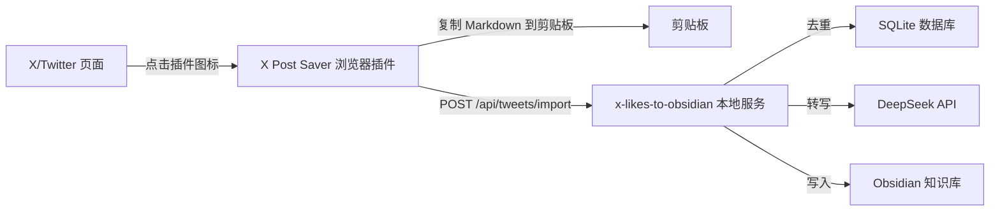
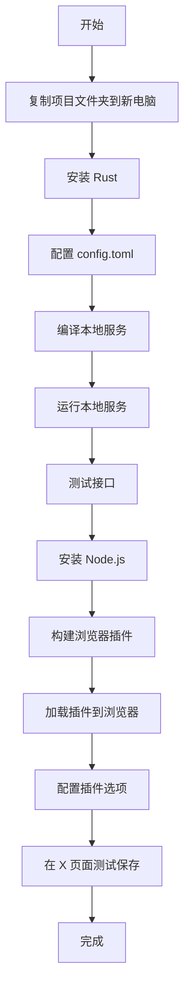
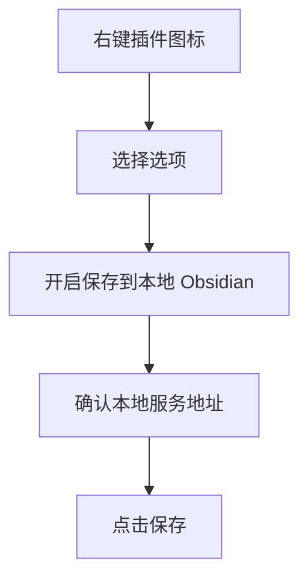

# X Post Saver + x-likes-to-obsidian 跨电脑安装指南

> **文档状态**：现行操作文档  
> **范围**：浏览器扩展（本仓库）+ 本地 Rust 服务（同级目录 `x-likes-to-obsidian`）  
> **读者**：需要在新电脑从零装好整套「点图标 → Obsidian」链路的人。

> 本文面向新手，手把手说明如何在一台全新的 Windows 电脑上安装浏览器插件和对应的本地 Rust 服务，让你可以一键保存 X/Twitter 内容到 Obsidian。

---

## 一、这套系统是什么？

整套工具由两部分组成：

| 组件 | 作用 | 技术 |
|---|---|---|
| **X Post Saver** | Chrome/Edge 浏览器插件，在 X/Twitter 页面点击图标即可提取内容 | TypeScript + Chrome Extension MV3 |
| **x-likes-to-obsidian** | 本地 Rust 服务，接收插件数据，调用 DeepSeek 转写后写入 Obsidian | Rust + Axum + SQLite |

整体数据流如下：



---

## 二、安装前准备

### 2.1 你需要什么？

- 一台 Windows 电脑（Windows 10/11）
- 已安装 Chrome 或 Edge 浏览器
- 一个 Obsidian 知识库（本地文件夹）
- DeepSeek API Key（用于内容转写）
- 稳定的网络连接

### 2.2 需要安装的软件

| 软件 | 用途 | 下载地址 |
|---|---|---|
| Rust | 编译并运行本地服务 | https://rustup.rs/ |
| Node.js 18+ | 构建浏览器插件 | https://nodejs.org/ |
| Git（可选） | 克隆代码仓库 | https://git-scm.com/ |

> 如果你不会用 Git，可以直接复制整个项目文件夹到另一台电脑。

---

## 三、整体安装流程



---

## 四、第一步：安装并运行本地 Rust 服务

### 4.1 复制项目文件

把整个项目文件夹（例如 `06-x`）复制到新电脑的某个固定位置，例如：

```text
D:\Tools\06-x\
```

进入本地服务目录：

```powershell
cd D:\Tools\06-x\x-likes-to-obsidian
```

### 4.2 安装 Rust

打开 PowerShell，执行：

```powershell
# 下载并安装 Rust
Invoke-WebRequest https://win.rustup.rs/x86_64 -OutFile rustup-init.exe
.\rustup-init.exe
```

按提示选择默认安装（按 Enter 即可）。安装完成后，关闭并重新打开 PowerShell，验证：

```powershell
rustc --version
cargo --version
```

如果能看到版本号，说明安装成功。

### 4.3 配置 config.toml

在 `x-likes-to-obsidian` 目录下找到 `config.toml`，用文本编辑器打开，根据你的实际情况修改：

```toml
[server]
host = "127.0.0.1"
port = 18787

[obsidian]
vault_path = "D:/你的Obsidian库路径"
target_folder = "00-Inbox/X"
keep_original = true

[database]
path = "./data/x_likes_to_obsidian.db"

[deepseek]
base_url = "https://api.deepseek.com"
api_key = "sk-你的DeepSeekKey"
model = "deepseek-v4-flash"
temperature = 0.2
max_retry = 3

[rewrite]
language = "zh-CN"
```

**必须修改的两项：**

1. `obsidian.vault_path`：改成你的 Obsidian 库实际路径，例如 `D:/Documents/ObsidianVault`
2. `deepseek.api_key`：换成你自己的 DeepSeek API Key

> 注意：路径中的反斜杠 `\` 要改成正斜杠 `/`，或者直接使用 Windows 默认的路径写法。

### 4.4 编译本地服务

在 `x-likes-to-obsidian` 目录下执行：

```powershell
cargo build --release
```

第一次编译需要下载依赖，可能需要几分钟到十几分钟，请耐心等待。

编译完成后，可执行文件位于：

```text
x-likes-to-obsidian\target\release\x-likes-to-obsidian.exe
```

### 4.5 复制配置文件到 release 目录

编译不会自动复制 `config.toml`，需要手动复制：

```powershell
copy config.toml target\release\
```

### 4.6 运行本地服务

#### 方式 A：控制台运行（适合测试）

```powershell
cd target\release
.\x-likes-to-obsidian.exe
```

如果看到类似下面的输出，说明服务启动成功：

```text
x-likes-to-obsidian started: http://127.0.0.1:18787
```

#### 方式 B：注册为 Windows 服务（适合长期使用）

1. 把以下两个文件复制到一个固定目录，例如 `C:\Tools\x-likes-to-obsidian\`：
   - `x-likes-to-obsidian.exe`
   - `config.toml`

2. 以管理员身份打开 PowerShell，进入该目录：

```powershell
.\x-likes-to-obsidian.exe --install
sc start x-likes-to-obsidian
```

3. 查看服务状态：

```powershell
sc query x-likes-to-obsidian
```

服务会随 Windows 自动启动。

### 4.7 测试服务是否正常

打开浏览器或 PowerShell，访问健康检查接口：

```powershell
curl http://127.0.0.1:18787/api/health
```

如果返回 `ok`，说明服务运行正常。

---

## 五、第二步：安装浏览器插件

### 5.1 安装 Node.js

访问 https://nodejs.org/ 下载 LTS 版本并安装。

安装完成后，验证：

```powershell
node --version
npm --version
```

### 5.2 安装插件依赖

进入插件目录：

```powershell
cd D:\Tools\06-x\ddcherry-twitter
```

安装依赖：

```powershell
npm install
```

### 5.3 构建插件

```powershell
npm run build
```

构建成功后，会生成 `dist` 目录，里面就是可以加载到浏览器的扩展文件。

### 5.4 加载插件到 Chrome/Edge

1. 打开 Chrome 或 Edge 浏览器
2. 在地址栏输入 `chrome://extensions/` 或 `edge://extensions/`
3. 打开右上角的「开发者模式」
4. 点击「加载已解压的扩展程序」
5. 选择 `ddcherry-twitter\dist` 目录

加载成功后，你会在浏览器工具栏看到插件图标。


---

## 六、第三步：配置插件

1. 右键点击浏览器工具栏的插件图标，选择「选项」
2. 在选项页中：
   - 开启「保存到本地 Obsidian（需先启动本地服务）」
   - 本地服务地址保持默认 `http://127.0.0.1:18787`
   - （可选）填写 apiUrl / apiKey，用于保存到远程后台 API
3. 点击「保存」



---

## 七、第四步：测试使用

1. 确保本地 Rust 服务正在运行
2. 打开 Chrome/Edge，访问任意 X/Twitter 帖子详情页，例如：
   ```text
   https://x.com/username/status/1234567890
   ```
3. 点击浏览器工具栏的插件图标
4. 你会收到通知：「已复制到剪贴板」
5. 如果开启了本地 Obsidian 选项，稍后会收到第二条通知：「已保存到本地 Obsidian」
6. 打开 Obsidian，进入你配置的 `target_folder` 目录，应该能看到新生成的 Markdown 文件

---

## 八、常见问题排查

| 问题 | 可能原因 | 解决方法 |
|---|---|---|
| 插件图标点击没反应 | 不在 X/Twitter 页面 | 确保在帖子详情页或文章页使用 |
| 提示「本地 Obsidian 服务无法连接」 | 本地服务没启动 | 运行 `x-likes-to-obsidian.exe` 或启动 Windows 服务 |
| 提示复制成功但 Obsidian 没文件 | `vault_path` 配置错误 | 检查 `config.toml` 中的 Obsidian 库路径 |
| 服务启动失败 | 端口 18787 被占用 | 修改 `config.toml` 中的 port，或关闭占用端口的程序 |
| 转写失败 | DeepSeek API Key 无效 | 检查 `deepseek.api_key` 是否有效 |
| 编译失败 | Rust 未安装或网络问题 | 重新安装 Rust，确保网络可访问 crates.io |
| 插件加载失败 | 没有选对 dist 目录 | 确保选择的是 `ddcherry-twitter/dist` 文件夹 |

---

## 九、目录结构参考

安装完成后，关键文件位置如下：

```text
D:\Tools\06-x\
├── ddcherry-twitter\
│   ├── dist\                  # 浏览器插件加载目录
│   ├── src\                   # 插件源码
│   ├── package.json
│   ├── README.md
│   └── docs\
│       └── 安装指南.md        # 本文（整套安装说明）
├── x-likes-to-obsidian\
│   ├── config.toml            # 服务配置文件
│   ├── Cargo.toml
│   ├── src\                   # Rust 源码
│   └── target\release\
│       ├── x-likes-to-obsidian.exe
│       └── config.toml        # 运行时读取的配置
```

---

## 十、快速检查清单

在开始使用之前，确认以下事项：

- [ ] Rust 已安装（`cargo --version` 有输出）
- [ ] Node.js 已安装（`node --version` 有输出）
- [ ] `config.toml` 中的 `obsidian.vault_path` 已修改为你的 Obsidian 库路径
- [ ] `config.toml` 中的 `deepseek.api_key` 已替换为你自己的 Key
- [ ] 本地服务已编译成功（`target/release/x-likes-to-obsidian.exe` 存在）
- [ ] `config.toml` 已复制到 `target/release/` 目录
- [ ] 本地服务已启动，访问 `http://127.0.0.1:18787/api/health` 返回 `ok`
- [ ] 浏览器插件已加载（在 `chrome://extensions` 中能看到）
- [ ] 插件选项中已开启「保存到本地 Obsidian」
- [ ] 在 X/Twitter 页面点击插件图标后收到成功通知
- [ ] Obsidian 中能看到新生成的 Markdown 文件

---

## 十一、更新代码后怎么办？

如果你后续修改了源码，需要重新构建：

**本地服务更新：**

```powershell
cd x-likes-to-obsidian
cargo build --release
copy config.toml target\release\
```

**浏览器插件更新：**

```powershell
cd ddcherry-twitter
npm run build
```

然后回到 `chrome://extensions/` 页面，点击插件卡片上的刷新按钮。

---

**祝你使用愉快！**
